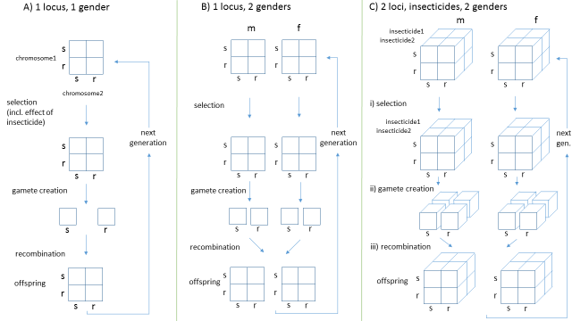

```{r, eval=FALSE, include=FALSE}
#!!!! paper protocol
#!!!! might be easier to put text & figs into separate Rmd files after draft stage
#!!!! drafts knit to pdf with pdf_document in YAML and this chunk eval=FALSE
#!!!! submission MS, knit to word_document, YAML, this chunk eval=FALSE, 
#!!!!  in WORD: delete figs, add fig numbers to fig legends, set double space, add line numbers 
#!!!! submission figs, set this chunk to eval=TRUE

# options to create final publication quality figures
# causes the document to fail, but the figs do get stored in pap2figs/
library(knitr)
opts_chunk$set(dev="tiff",
               dev.args=list(compression="lzw"),
               dpi=300,
               cache=FALSE,
               fig.path='pap2figs/')
```

```{r,echo=FALSE,results='hide',warning=FALSE}
  library(resistance)
  library(ggplot2)
```

### version 9

#Evolution of insecticide resistance with insecticide mixtures and sequences : an accessible model to promote understanding.

#An accessible model to promote understanding of the evolution of insecticide resistance : insecticide effectiveness predicted to be key to the relative performance of mixtures.

#A tutorial, primer ...
 
#Insecticide effectiveness predicted to be most important factor determining whether insecticide mixtures can slow evolution of resistance. 

Target : Malaria journal

THIS IS A CONFIDENTIAL COPY OF THE MS. Please do not circulate without the express permission of one of the authors. Comments and & suggestions welcome

## Abstract

_must be 350 words, currently 375 with subheadings Background, Results & Conclusions_

##### Background
Insecticide resistance has been identified as a major problem for the control of malarial mosquitoes with potentially huge consequences for malaria burden. To address this problem effort is being made to develop new insecticide tools including new active ingredients and combinations with existing ones. There are different potential strategies for using new insecticides and recomendations for how best to preserve their utility for controlling mosquitoes and malaria. There is however limited recent, accessible modelling work to support suggestions of which strategies may be best in different situations. Previous work suggests that preferred strategies will be situation specific. This points to a need for an accessible, mechanistic understanding of how the evolution of insecticide resistance is likely to respond to potential intervention strategies to help guide both management and policy. Such a mechanistic understanding could allow a more robust response to uncertainty in parameter values in field situations.*finesse that sentence or move to discussion*    

Here we use a relatively simple model to develop a mechanistic understanding of how insecticide resistance is expected to increase under different intervention strategies, namely the use of insecticides in isolation, sequence and mixtures. The model flexibly represents two independent genes coding for resistance to two insecticides allowing us to represent the different intervention strategies. We look principally at the ability of the insecticides to kill susceptible mosquitoes, the proportion of mosquitoes that come into contact with the insecticide, and how much the resistance alleles counteract the effect of the insecticide.  

##### Results
We show firstly that using a second insecticide, in a mixture with a first, always slows evolution of resistance to the first. Secondly we show that the ability of an insecticide to kill the susceptible mosquitoes (effectiveness), is the most important factor influencing whether using insecticides in a sequence or a mixture is likely to lead to faster resistance to both of them. The mechanisms behind these results are explained. We discuss how these results can inform intervention strategies in the field. 

##### Conclusions
We describe an R package and user-interface that allows further exploration of the development of resistance. The user-interface (https://andysouth.shinyapps.io/MixSeqResist1) allows replication of our results and exploration of what happens when inputs are changed outside of the ranges we have used. 


## Keywords
insecticide resistance; public health; mosquitoes; vector-borne diseases; infectious diseases; malaria; population genetics


## Background

Insecticide resistance is a problem for malaria [@WHO2012][@Ranson2016][@Hemingway2016] other vector borne diseases [@IRAC2011] and agriculture [@FAO2012]. Focusing on malaria which still results in hundreds of thousands of deaths per year, recent control efforts have centred on treated bed nets and indoor residual spraying, both reliant on insecticides. Treated nets were recently estimated to contribute 68% and indoor residual spraying 13% to averting more than 500 million malaria cases between 2000 and 2015 [@Bhatt2015]. A recent malaria transmission model [@Churcher2016] predicts that even low pyrethroid resistance is likely to increase malaria incidence in Africa by reducing the performance of bed nets.

There have been modelling studies investigating the evolution of insecticide resistance in insecticide mixtures including in a public health context e.g. [@Curtis1985][@Mani1985][@Roush1989] but much of the modelling work was done more than 20 years ago and there remained some confusion about the results [@Levick2017]. For those who (wisely in some cases) distrust models, work in a moth and genetically modified brocolli system has shown that toxins used in combination can delay the onset of resistance in a way that is consistent with theoretical models [@Zhao2003]. 

The Innovative Vector Control Consortium (IVCC) was set up in 2005 to develop new vector control tools and particularly new insecticides to address insecticide resistance in malaria transmitting mosquitoes [@Hemingway2006][@IVCC2016]. Three new insecticides are now in development [@IVCC2016] and likely to be available around 2020 [@Ranson2016]. It is important that decisions about how best to use the new insecticides to delay the onset of resistance are made before insecticides are released [@Hemingway2016]. The model presented here can help inform strategies to minimise the development of resistance in new and existing insecticides.

Insecticide resistance becomes a problem when genes coding for resistance firstly arise in a population and secondly increase in frequency. We concern ourselves with this second process of how insecticide resistance increases in frequency within a population. It is likely that genes conferring resistance are present in populations even prior to exposure to novel insecticides thus leading to the potential for selection [@Liu2015]. The changing frequency of insecticide resistance is a population genetic process that can be influenced by (among others) the parameters outlined in Table 1.

_TODO add in here about theory of IR & protocols for resistance management._


We use a 2-locus population genetic model of insecticide resistance [@Levick2017] to illustrate the mechanisms by which these parameters are expected to influence the development of insectide resistance under alternative insecticide use strategies. In an earlier paper [@Levick2017] we described the technical details of the model and explore large parameter ranges. We provide an accessible summary of the model and use selected parameter values to develop a mechanistic understanding of how inputs influence the development of resistance. This mechanistic understanding can provide a more robust framework for the debate on the relative merits of different insecticide strategies extending existing frameworks [@Roush1989][@IRAC2011][@FAO2012][@WHO2012]. 


**Table 1. Parameters inflencing the development of insecticide resistance**

Parameter  | Description
------------------- | -------------------------------------------------------
1. Effectiveness | proportion of susceptible (SS) insects killed by exposure to insecticide
2. Exposure | proportion of insects exposed to the insecticide
3. Dominance | resistance of an insect with only 1 resistance allele (SR)
4. Resistance restoration  | ability of resistance (RR) to restore fitness when insect exposed to the insecticide
5. Frequency  | frequency of resistance alleles within the population


## Methods

The simulation represents a population of randomly mixing individuals using standard population genetic approaches to avoid the need to follow every individual. One locus is represented for each insecticide. There are two potential alleles per locus. Each allele confers either resistance or susceptibility to the insecticide. Fitness is the main currency of the model, representing how much each genotype survives and reproduces, with a maximum value of 1 defined as the fitness of the SS genotype in absence of the insecticide. The fitness of an individual depends on it's alleles, exposure to the insecticide and other inputs that can be set in the model. These inputs include the effectiveness of the insecticide, the dominance of the resistance allele and the ability of resistance to restore fitness in the presence of the insecticide (see Table 1). Each of these inputs can be varied as a proportion between 0 and 1. We use 'Resistance restoration' to represent how much the RR genotype restores fitness in the presence of the insecticide. The more conventional 'selection coefficient' is calculated by multiplying Resistance restoration by insecticide effectiveness. Doing it this way allows us to vary all inputs between 0 and 1 without fitness going above 1 in the model.

The simulation proceeds through generations. In each generation selection is represented by multiplying genotype frequencies in the population by their relative fitness. This acts to make the fitter alleles more common over time. Thus a summary of the selection stage is :

> selection coefficient = resistance restoration * effectiveness  
>
> Locus fitness : 	
> SS = 1-effectiveness  
> RS = 1-effectiveness + (dominance*selection coeff.)  
> RR = 1-effectiveness + selection coeff.  
> 
> Genotype fitness :   
> SS1SS2 = SS * SS  
> SS1RS2 = SS * RS  
> … and for other combinations  
> RR1RR2 = RR * RR  
> 
> Population fitness = Genotype fitness * exposure to insecticide  
> 
> In each generation :   
> Allele frequency[t+1] = Allele frequency[t] * Population fitness  


Sexual reproduction is represented first by creating gametes by splitting the adult genomes in two with recombination, and second by forming offspring genotypes by adding gametes.

So far this description just considers a single insecticide and associated resistance allele, with equal behaviour for males and females (Fig 1A). To allow males and females to be exposed differently separate genders are also represented (Fig 1B). In addition a second insecticide and resistance allele are included and fitness is calculated by multiplying these with those for the first insecticide described above (Fig 1C). Thus the simulation can represent populations exposed to two insecticides together in a mixture. 

Here we principally look at model outputs of the change in resistance allele frequencies over time (generations). Resistance allele frequencies are calculated from the frequencies of each genotype as follows.

> Resistance allele frequency = (2*RR + RS) / 2

We investigate three insecticide use strategies.

1. single insecticide
1. two insecticides used in sequence, replacing the first with a second once the proportion of resistance alleles reaches a threshold of 50%
1. two insecticides used in a mixture (concurrently)

The model is implemented in R [@RCoreTeam2016], the code is hosted on Github [@South2017] and we provide an online user interface [@South2017a] (Fig 2) enabling the reader to change inputs and run the model themselves.


## Results


### Single insecticide
For single insecticide use, higher values of insecticide effectiveness, exposure, dominance or resistance restoration resulted in faster resistance spread (Fig 3 A-D) and thus fewer generations to reach the resistance threshold of either 0.5 or 0.75. 

Similarly, higher values of starting resistance frequency also resulted in faster spread of resistance (Fig 4) and shorter times to resistance thresholds.


### Two insecticides
When two insecticides are used the relative performance of a mixture strategy compared to sequential use changes dependent on input values. To help understand the mechanisms influencing this relative performance we started with a single base scenario and investigated changing inputs individually. The base scenario was similar to that used for the single insecticide. Values for the first four inputs in Table 1 were set to 0.5 and the starting frequencies of resistance to 0.01. For this base scenario resistance arises slower for sequential than mixture (Fig 5A). This plot, and those that follow, compares mixture and sequence for a single combination of inputs. Resistance to both insecticides in the mixture follow the same path and reach the threshold at the same time (as would be expected given that they have identical input parameters). When used in sequence the curve (dashed) for each insecticide individually is steeper than in the mixture but, because they happen one after the other, it takes longer for both to reach the resistance threshold of 50%.

#### results: Insecticide exposure and effectiveness

Increasing exposure to the insecticides (the proportion of insects that come into contact) from 0.5 to 0.8 (Fig 5C) decreases the time-to-resistance for both the sequential and mixture strategy and so does not change their relative performance; time-to-resistance remains longer for the sequence. In contrast keeping the exposure constant at 0.5 and increasing effectiveness (the proportion of SS insects that are killed by contact) of one of the insecticides to 0.8 (Fig 5D) results in a longer time-to-resistance for the mixture relative to the sequence. Resistance for the more effective insecticide (in red) increases faster than the less effective. Resistance to the less effective insecticide in the mixture increases slowly initially and then speeds up after the more effecttive insecticide has reached the resistance threshold (~50 generations).  


Thus a more effective insecticide increases time-to-resistance when used in a mixture (compare the solid lines in Fig 5A & B). This is opposite to what happens when used in sequence (compare the red dashed line in Fig 5A & B) and in isolation (Fig 2A), when more effective insecticides shortened times-to-resistance. Figure 5D has the same inputs as Fig 5B except that the exposure is increased from 0.5 to 0.8. The increase in exposure reduces time-to-resistance more for the mixture relative to the sequence. The result is that the advantage of mixtures over sequence is removed by the increase in exposure, leading to approximately equal times-to-resistance for the two strategies (Fig 5D). 


Figure 6 shows how increasing the effectiveness of either or both insecticides improves the performance of mixtures over sequences in terms of time-to-resistance. Figure 6A uses the same inputs as Fig 5B. From this scenario a higher effectiveness for insecticide2 (Fig 6C) or insecticide 1 (Fig 6B) or both (Fig 6D) all result in a greater positive difference in time-to-resistance for mixture over sequence.


Reduced male exposure with respect to female, as might be expected for male mosquitoes not seeking blood meals, had a similar effect to changing overall exposure. Reducing male exposure (not shown) increased times-to-resistance and favoured mixtures over sequences.


#### results: Dominance and resistance restoration
Increasing dominance or resistance restoration decreases time-to-resistance for both sequences and mixtures (Fig 7) in the same way that it did for sole use (Fig 3). The result is that increasing either or both of dominance and resistance restoration (Figs 7B,C,D) doesn't change the relative time-to-resistance for mixtures and sequences from that in the base scenario (Fig 7A) where it takes resistance longer to develop for the sequence.


#### results: Starting frequencies of resistance
Changing the starting frequency of resistance had a similar effect on time to resistance for both sequences and mixtures and thus had little effect on their relative performance. For example taking the base scenario and reducing the starting frequency of one resistance allele did not change from sequence being favoured (compare Fig 8C to 8A). Similarly taking a scenario in which time-to-resistance is longer for a mixture (Fig 8B) and decreasing the starting frequency of that resistance allele did not change the fact that the mixture was favoured (Fig 8D). 


It has previously been suggested [@Curtis1985][@WHO2012] that using an insecticide to which there was existing resistance in a mixture with a new insecticide with little resistance could lead to more rapid evolution of resistance to the latter through a process termed linkage disequilibrium. Figure 8 C&D show how our model predicts that linkage disequilibrium does not lead to more rapid evolution of resistance to the newer insecticide. In Figures 8 C&D the newer insecticide with lower starting resistance (in red) leads to faster resistance when used alone (red dotted) than when used in a mixture (red solid).


## Discussion

The response of resistance to insecticide use in the model can be explained by mechanisms that can help us develop and communicate a more robust understanding of how we would expect resistance to respond in the field.


When single insecticide use was represented (Figs 3-4) in all cases the initial increase in resistance was most rapid with straight lines on the log plots up to around 50% followed by a slowing rate of increase up to 100%. Higher values of the five inputs investigated all led to more rapid increases in resistance. For single insecticide use resistance responded identically to changing exposure and effectiveness (compare Fig 3A to 3B). This makes sense as vector kill is effectively a product of exposure times effectiveness. For example exposing 50% of a  population to an insecticide which is 75% effective would be expected to have the same result as exposing 75% of the population to one which is 50% effective. This observation points to the mechanism by which increasing both exposure and effectiveness lead to a faster increase in resistance. In both cases the increased deaths of susceptible vectors cause a higher selection pressure that can explain the faster increase.


The pattern of more rapid increase in resistance at higher dominance levels (Fig 3C) can be explained by increased survival of heterozygotes in the presence of the insecticide. Higher dominance of the resistant allele causes it to contribute more to the phenotype of the heterozygotes leading to higher survival. Thus selection pressure for the resistance allele will be increased because it confers more of an advantage when only present on one chromosome. The faster development of resistance under higher resistance-restoration (Fig 3D) can be explained by it's effect on the survival of the resistant genotypes. Resistance-restoration restores the survival of resistant genotypes in the presence of the insecticide back towards what it would be in the absence of the insecticide, thus increasing the selection pressure of the resistance allele. The effect of the starting frequency of resistance (Fig 4) is the most different from the other inputs. Simply, when starting from a higher frequency of resistance there is a smaller change to make to reach the higher resistance thresholds.


These mechanisms, explaining the response of resistance to single insecticide use under different input values, are summarised in Table 2. Exposure and effectiveness act by decreasing the survival of all genotypes, dominance acts by increasing survival of RS and resistance-restoration acts by increasing survival of RR & RS. 


#### discussion: Two insecticides

In comparison with the use of a single insecticide, using two insecticides either in sequence or in mixtures differs in some ways and where it differs that can again help us to understand the mechanisms. Looking at our base scenario (Fig 5A) the curves for resistance to both insecticides in the mixture are shallower than those for sequential use and in this particular example are identical because they have set the same parameter values for each insecticide to be the same. The shallower curves for the mixture can be explained by each insecticide killing individuals that are resistant to the other insecticide. Thus each insecticide reduces the selection pressure for the increase in resistance to the other and could be said to 'protect' the other. However this protection is not necessarily enough to ensure that resistance arises more slowly in a mixture relative to a sequential strategy. As shown in our base scenario, resistance can arise more slowly for both insecticides in sequential use, despite being faster for each, because they occur one after the other.


#### discussion: Insecticide effectiveness

The main difference between mixtures and the other strategies is that in mixtures increasing the effectiveness of either insecticide slows the development of resistance to both (compare Fig 5B to 5A). In contrast in both the sequential (Fig 5B) and single insecticide (Fig 2A) scenarios the development of resistance was faster when effectiveness was higher. This can be explained by the increased effectiveness of one insecticide in a mixture increasing killing of vectors that are resistant to the other and thus decreasing selection pressure.


This effect can be seen by comparing Fig 5B, where the effectiveness of insecticide 1 has been increased, to Fig 5A. In the mixture, resistance to insecticide 1 (with the increased effectiveness) rises at a similar speed in both figures. However, the increased effectiveness of insecticide 1 causes resistance to insecticide 2 to increase more slowly initially in the mixture. Once insecticide 1 reaches resistance of around 50% at around 50 generations, the curve for insecticide 2 becomes steeper. Once the first insecticide has become ineffective due to resistance it stops killing individuals that are resistant to the second insecticide and thus stops limiting the rise in resistance to the second insecticide. A similar effect is visible when the effectiveness of both insecticides are increased (Fig 6C). The identical resistance curves for each insecticide in the mixture are shallower than at the lower effectiveness (Fig 5A) because more individuals resistant to each insecticide are being killed by the other insecticide. In this case the 'protection' given to both insecticides by the other declines at the same rate so we don't see the change in slope seen in Fig 5B. 


Fig 5B also demonstrates that when two insecticides have a different effectiveness in a mixture, other parameters being equal, resistance will be expected to increase faster to the more effective insecticide. The more effective insecticide prompts both a) higher selection pressure for it's own resistance and b) greater 'protection' reducing the rise in resistance to the other insecticide.     


#### discussion: Exposure vs effectiveness
It seems initially counter-intuitive that whereas increasing effectiveness slows the development of resistance for mixtures, increasing exposure speeds it up. Increasing the exposure to both insecticides results in a decrease in time-to-resistance (from 90 generations in Fig 5A to 40 generations in Fig 5C) where increasing the effectiveness of both insecticides by the same amount results in a slight increase (from 90 in Fig 5A to 110 in Fig 5B). This contrasts with the identical effects that exposure and effectiveness have on a single insecticide (Figs 3 A,B) and on insecticides in sequence (the red dashed lines are the same in Figs 5B & 5C). This difference between effectiveness and exposure was unexpected for us. 
_todo could this be because exposure results doesn't alter the relative fitness of genotypes because all genotypes are exposed equally ? doesn't quite make sense to me_

The mechanisms involved in the response of resistance in mixtures are summarised in Table3. Whether a mixture or sequence is favoured for reducing the spread of resistance will depend on these mechanisms and is summarised in Table 4.


#### discussion: caveats
It is worth re-iterating that we are looking solely at the evolution of resistance and not at the control of mosquitoes or malaria. As such our model would predict that the best strategy for limiting the development of resistance in the short term would be to use no insecticide. Using no insecticide could have serious consequences for mosquito and malaria abundance. The challenge is to develop good strategies for delivering mosquito and malaria control in the short term while sustaining that in the longer term by restricting the development of resistance. Others are looking at combining models of population genetics and population dynamics to investigate these trade-offs [@Barbosa2017].


The development of insecticide resistance in operational field settings is subject to considerable uncertainty [@Ransom2016]. The model we present here is able to cover the range of that uncertainty, yet in this paper, to develop an understanding of the key mechanisms we restrict our explorations to a limited region of paramter space (e.g. holding most inputs constant at intermediate values while modifying single inputs in isolation). Thus there is the potential that the system may behave differently in the field than we describe here. However, the results presented here are supported by an earlier analysis where we ran 10,000 unique scenarios varying more inputs [@Levick2017]. In addition we provide an online user interface to the model [@South2017a] and enabling readers to investigate model behaviour in areas of parameter space we have not shown here.


#### discussion: putting results into context 

I will now put these predicted responses of resistance into the context of previous work and recomendations. Earlier modelling work has made sometimes contrasting predictions and these can be explained by the details of their structure and the particular situations they represent. One model predicted that "the use of mixtures is always more effective in delaying the onset of resistance often by many orders of magnitude"[@Mani1985]. That model assumed that SS genotypes were always killed, RR always survived, and that a constant 10% of mosquitoes escaped the insecticide. This would be represented in our model by a very high 'insecticide effectiveness' of 1, a 'resistance restoration' of 1 and an 'exposure' of 0.9. This result is consistent with our prediction that the very high effectiveness is likely to favour mixtures over sequences (e.g. see Fig 6D).


A subsequent model [@Roush1998] lead to the following more pessimistic conclusion about the potential of mixtures : “As a result of incomplete coverage and residue decay, the mortality of susceptible homozygotes is rarely consistently high enough for pesticide mixtures to be effective” [@Roush1998]. This "mortality of susceptible homozygotes" is equivalent to the parameter we have termed insecticide effectiveness, so lends further support to our main conclusion of the importance of effectiveness. It's also shown [@Roush1998 Fig 3] that decreasing exposure from 90% to 80% also increases the benefit of mixtures over sequences in the same way that we have shown.


Modelling and theory have been used to generalise Insecticide Resistance Management into three potential strategies [@Georghiou1994]. These are A) moderation : preserving susceptible genes by limiting selection pressure, B) saturation : high dose so that heterozygous resistants are killed and C) multiple attack : independently acting pressures neither of which is strong enough to lead to resistance. Our work here principally focuses on multiple attack but the other strategies are relevant too. _todo expand this paragraph_ 


One consistent aspect of the results presented here can at first seem to go against current advice on good practice. We show that lower insecticide effectiveness or exposure are expected to lead to slower spread of resistance in sole use and sequences (Figs 3 & 5). This is consistent with expectations that lower effectiveness and exposure would lead to lower mortality of susceptibles and thus lower selection pressure for resistance [e.g. @Roush1998]. In contrast the widely held view seems to be that low effectiveness or exposure associated with poor implementation can promote the development of resistance. e.g. from [@FAO2012] "Certain pest control practices have consistently been shown to exacerbate the loss of susceptible pest populations and the development of resistance. These include: ... - the use of application rates that are below or above those recommended on the label; - poor coverage of the area being treated ...". The explanation for this apparent difference is in the effect of dominance. Poor application can reduce the mortality of heterozygotes (RS) thus effectively increasing the dominance of the resistant allele and increasing its rate of spread in the population [?ref]. Our model does show that increasing dominance leads to faster spread of resaistance (Fig 3C, 7). So, the effect of poor implementation of an insecticide intervention on resistance could be either positive and negative depending on the relative effects on dominance of the resistance gene, insecticide effectiveness and exposure. Our model cobined with laboratory and field results could help to assess these trade-offs.


Experience from agriculture where single interventions have been associated with a rapid development of resistance have led for calls for a more Integrated Vector Management composed of a series of partially effective tools [@Thomas2012]. It is suggested that such an integrated approach is more sustainable and 'evolution-proof' [@Thomas2012]. A similar combining of interventions has been advocated to cover mosquitoes exhibiting different behaviours [@Killeen2017]. Mosquitoes with different behaviours e.g. feeding outdoors and/or on animals are likely to result in lower exposures to insecticides in nets or sprayed on walls. This lower exposure could favour mixtures over sequences as we have indicated. In both cases our modelling approach could be used to investigate implications for the devlopment of resistance.


## FINAL CONCLUDING PARAGRAPH

~ Effectiveness and exposure are key and can be modified.
~ The model we describe is flexible and as such can reproduce similar results to earlier models and be used to represent more detailed, operationally relevant strategies. 


### other papers to incorporate into discussion above

Roush older paper : [@Roush1989] 

Relevance of these mechanisms in the field e.g. exposure can be reduced if either insecticide has a repellant effect, which can be set in formulation. [@Birget2015a] mention this not for resistance but for ITNs with repellancy requiring higher coverage for elimination)
_TODO check which of the Birget papers mention this_

How do the rest of our results relate to recomendations that have been produced by WHO[@WHO2012], IRAC[@IRAC2011] and FAO[@FAO2012] ?

[@Taillebois2016]
Laboratory experiments on aphids showing that in low dose mixtures insecticides most often had additive effects as represented in our model, but that also commonly mortality was higher than expected (synergistic) which we can also represent within the model. 

[@Barbosa2011] 
_suggests incomplete dominance in the field_

[@Birget2015] 
We show that indoor use of insecticides leads to less selection pressure than their use as larvicides. 
Reasons for relatively low selection pressure by adulticides
(i) males are not affected by the ITNs
(ii) insecticides are also repellents, keeping mosquitoes at bay from contacting the insecticide but also driving them to bite either people who do not use the insecticide or alternative hosts.

[@Curtis1998]
can anything be done to maintain effectiveness of nets ?

[@Kliot2012]
fitness costs associated with insecticide resistance

Good review of tactics for IRM inlcuding mention of mixtures and new AIs [@Denholm1992]
"Once developed and marketed, new products introduce a fresh challenge how to exploit their characteristics while restricting exposure to preserve their effectiveness." 


### Discussion some summary points probably already covered ...

(@) In a mixture each insecticide reduces the rate of increase in resistance to the other by killing individuals that are resistant to the other.

(@) In a mixture higher effectiveness of either insecticide kills more individuals resistant to the other and thus increases time-to-resistance for the other. Thus although increasing effectiveness of an insecticide decreases time-to-resistance when used alone, when used in a mixture time-to-resistance for both insecticides is increased.

(@) For a mixture of 2 insecticides with differing effectiveness. Resistance to the insecticide with a greater effectiveness increases faster. The less effective insecticide is 'protected' by the more effective. Resistance to the less effective insecticide increases slowly until resistance to the more effective insecticide reaches a high level.

(@) exposure ...


### Declarations
TODO see https://malariajournal.biomedcentral.com/submission-guidelines/preparing-your-manuscript/research-article

##### Ethics approval and consent to participate
Not applicable
##### Consent for publication
Not applicable
##### Availability of data and material

##### Competing interests

##### Funding

##### Authors' contributions
AS conceived the paper, re-factored the model code, performed the analyses and wrote the first and subsequent versions of the paper. IH conceived the modelling approach, developed the first version of the model in collaboration with Bethany Levick, explained concepts to AS and reviewed and commented on all manuscript versions.

##### Acknowledgements
Thankyou to Bethany Levick who developed the first version of the model code.


**Table 2. Effect of inputs on resistance when insecticides used singly or in sequence**

Parameter to increase  | effect on resistance | Mechanism
------------------ | ------- | ---------------------------------------------------
1. Effectiveness | faster | increased deaths of susceptibles
2. Exposure | faster | increased deaths of susceptibles
3. Dominance | faster | increased survival of heterozygotes
4. Resistance restoration | faster | increased survival of resistants
5. Frequency  | faster | less change needed to reach resistance threshold

**Table 3. Effect of inputs on resistance when insecticides used in a mixture**

Parameter to increase  | effect on resistance | Mechanism
------------------ | --------- | ---------------------------------------------------
1. Effectiveness | **slower** | increased deaths of individuals resistant to the other insecticide
2. Exposure | faster (but less than for single) | increased deaths of individuals susceptible to one insecticide increases selection pressure for that resistance. However at the same time selection pressure is reduced by higher deaths of resistant individuals caused by the other insecticide.
3. Dominance | faster | increased survival of resistants
4. Resistance restoration | faster | increased survival of resistants
5. Frequency  | faster | less change needed to reach resistance threshold

**Table 4. Effect of inputs on the difference between mixture and sequential use**

Parameter to increase  | increase favours mix or sequence | Mechanism
------------------ | ------- | ---------------------------------------------------
1. Effectiveness | mixture | Higher effectiveness gives faster resistance for sequence and slower resistance in mixture
2. Exposure | sequence | Higher exposure gives faster resistance for sequence and mixture but the greater effect on mixture favours sequence.
3. Dominance | neither | Higher dominance gives faster resistance in both sequences and mixtures such that the difference between them is not changed. 
4. Resistance restoration | neither | As for dominance. Higher resistance restoration gives faster resistance in both sequences and mixtures such that the difference between them is not changed.
5. Frequency  | neither | As for dominance and resistance restoration. Higher starting frequencies give faster resistance in both sequences and mixtures such that the difference between them is not changed.


## ANDY TO DO
1. remove first person for Malaria journal
1. explain resistance thresholds and time-to-resistance in methods
1. refer to ratios of mix:seq in plots
1. refer to PRCC from pap1 in ref. to Table4
1. mention single gene vs additive effects (with ref.)
1. can I add a diagram to help with methods, e.g. perhaps fitness under difference inputs, similar to fitnessvis ?
1. in discussion refer to linkage disequilibrium about Fig 8D
1. is there a reference to say that the effectiveness of insecticides can be modified at the design stage, or by the dose ?
1. mention other potential effects e.g. costs of resistance, sex linkage, ..._
1. cite in press Killeen about combining interventions

\pagebreak

## Figures




```{r Fig3, eval=TRUE, echo=FALSE, warning=FALSE, message=FALSE, fig.height=7.5, fig.width=7.5, fig.show='hold', fig.align='left', fig.cap="Single insecticide use and the effect of inputs on changing resistance frequency over time. A. Effectiveness, B. Exposure, C. Dominance, D. Resistance restoration. Increasing any of the inputs (going from red to blue) results in shorter times-to-resistance. For each panel the chosen input was varied in isolation with the remaining inputs set to 0.5, except for starting frequency of resistance which was set to 0.01). "}

  library(cowplot)
  
  #list to put plots in for cowplot
  plotlist <- list(4)

  #A effectiveness  
  a <- setExposure(exposure=0.5, insecticideUsed='insecticide1')

  i1 <- setInputOneScenario( max_gen = 500,
                      h.RS1_A0 = 0.5, 
                      h.RS2_0B = 0.5,
                      a = a,
                      phi.SS1_A0 = 0.2,
                      phi.SS2_0B = 0.5,
                      rr_restoration_ins1 = 0.5,
                      rr_restoration_ins2 = 0.5 )

  i2 <- setInputOneScenario( max_gen = 500,
                      h.RS1_A0 = 0.5, 
                      h.RS2_0B = 0.5,
                      a = a,
                      phi.SS1_A0 = 0.5,
                      phi.SS2_0B = 0.5,
                      rr_restoration_ins1 = 0.5,
                      rr_restoration_ins2 = 0.5 )

  i3 <- setInputOneScenario( max_gen = 500,
                      h.RS1_A0 = 0.5, 
                      h.RS2_0B = 0.5,
                      a = a,
                      phi.SS1_A0 = 0.8,
                      phi.SS2_0B = 0.5,
                      rr_restoration_ins1 = 0.5,
                      rr_restoration_ins2 = 0.5 )
  
  #input <- cbind(input, inputOneScenario)
  input <- cbind(i1,i2,i3)
  
  listOut <- runModel2( input )
  
  df_resist <- get_resistance(locus=1, listOut)

  #A  
  plotlist[[1]] <- ggplot(df_resist, aes(x=generation, y=resistance, colour=factor(phi.SS1_A0))) + 
         theme_bw() +  
         theme(legend.position = "bottom", legend.key = element_blank()) + 
         guides(colour = guide_legend(reverse=TRUE)) +  
         labs(colour = "effectiveness") +
         coord_trans(y = "log10") +    
         geom_line()   
  

  #B exposure
  exposure <- 0.2
  a <- setExposure(exposure = exposure, insecticideUsed='insecticide1')

  i1 <- setInputOneScenario( max_gen = 500,
                      h.RS1_A0 = 0.5, 
                      h.RS2_0B = 0.5,
                      a = a,
                      exposure = exposure, #used for post-run analysis
                      phi.SS1_A0 = 0.5,
                      phi.SS2_0B = 0.5,
                      rr_restoration_ins1 = 0.5,
                      rr_restoration_ins2 = 0.5 )
 
  exposure <- 0.5
  a <- setExposure(exposure = exposure, insecticideUsed='insecticide1')   

  i2 <- setInputOneScenario( max_gen = 500,
                      h.RS1_A0 = 0.5, 
                      h.RS2_0B = 0.5,
                      a = a,
                      exposure = exposure, #used for post-run analysis
                      phi.SS1_A0 = 0.5,
                      phi.SS2_0B = 0.5,
                      rr_restoration_ins1 = 0.5,
                      rr_restoration_ins2 = 0.5 )

  exposure <- 0.8
  a <- setExposure(exposure = exposure, insecticideUsed='insecticide1')  
  
  i3 <- setInputOneScenario( max_gen = 500,
                      h.RS1_A0 = 0.5, 
                      h.RS2_0B = 0.5,
                      a = a,
                      exposure = exposure, #used for post-run analysis
                      phi.SS1_A0 = 0.5,
                      phi.SS2_0B = 0.5,
                      rr_restoration_ins1 = 0.5,
                      rr_restoration_ins2 = 0.5 )
  
  input <- cbind(i1,i2,i3)
  
  listOut <- runModel2( input )
  
  df_resist <- get_resistance(locus=1, listOut)

  #B  
  plotlist[[2]] <- ggplot(df_resist, aes(x=generation, y=resistance, colour=factor(exposure))) + 
         theme_bw() +
         theme(legend.position = "bottom", legend.key = element_blank()) + 
         guides(colour = guide_legend(reverse=TRUE)) +
         labs(colour = "exposure", y=NULL) +
         coord_trans(y = "log10") +   
         geom_line()   
         
  #plot_grid( plotlist[[1]],plotlist[[2]],ncol=2, rel_widths=c(1,1), labels='AUTO') 
  

  #C single insecticide dominance
  a <- setExposure(exposure=0.5, insecticideUsed='insecticide1')

  i1 <- setInputOneScenario( max_gen = 500,
                      h.RS1_A0 = 0.2, 
                      h.RS2_0B = 0.5,
                      a = a,
                      phi.SS1_A0 = 0.5,
                      phi.SS2_0B = 0.5,
                      rr_restoration_ins1 = 0.5,
                      rr_restoration_ins2 = 0.5 )

  i2 <- setInputOneScenario( max_gen = 500,
                      h.RS1_A0 = 0.5, 
                      h.RS2_0B = 0.5,
                      a = a,
                      phi.SS1_A0 = 0.5,
                      phi.SS2_0B = 0.5,
                      rr_restoration_ins1 = 0.5,
                      rr_restoration_ins2 = 0.5 )

  i3 <- setInputOneScenario( max_gen = 500,
                      h.RS1_A0 = 0.8, 
                      h.RS2_0B = 0.5,
                      a = a,
                      phi.SS1_A0 = 0.5,
                      phi.SS2_0B = 0.5,
                      rr_restoration_ins1 = 0.5,
                      rr_restoration_ins2 = 0.5 )
  
  input <- cbind(i1,i2,i3)
  
  listOut <- runModel2( input )
  
  df_resist <- get_resistance(locus=1, listOut)

  #C 
  plotlist[[3]] <-ggplot(df_resist, aes(x=generation, y=resistance, colour=factor(h.RS1_A0))) + 
         theme_bw() +
         theme(legend.position = "bottom", legend.key = element_blank()) + 
         guides(colour = guide_legend(reverse=TRUE)) + 
         labs(colour = "dominance") +
         coord_trans(y = "log10") + 
         geom_line()   
         
  
  #D single insecticide resistance restoration 
  
  a <- setExposure(exposure=0.5, insecticideUsed='insecticide1')

  i1 <- setInputOneScenario( max_gen = 500,
                      h.RS1_A0 = 0.5, 
                      h.RS2_0B = 0.5,
                      a = a,
                      phi.SS1_A0 = 0.5,
                      phi.SS2_0B = 0.5,
                      rr_restoration_ins1 = 0.2,
                      rr_restoration_ins2 = 0.5 )

  i2 <- setInputOneScenario( max_gen = 500,
                      h.RS1_A0 = 0.5, 
                      h.RS2_0B = 0.5,
                      a = a,
                      phi.SS1_A0 = 0.5,
                      phi.SS2_0B = 0.5,
                      rr_restoration_ins1 = 0.5,
                      rr_restoration_ins2 = 0.5 )

  i3 <- setInputOneScenario( max_gen = 500,
                      h.RS1_A0 = 0.5, 
                      h.RS2_0B = 0.5,
                      a = a,
                      phi.SS1_A0 = 0.5,
                      phi.SS2_0B = 0.5,
                      rr_restoration_ins1 = 0.8,
                      rr_restoration_ins2 = 0.5 )
  
  input <- cbind(i1,i2,i3)
  
  listOut <- runModel2( input )
  
  df_resist <- get_resistance(locus=1, listOut)

  #D  
  plotlist[[4]] <- ggplot(df_resist, aes(x=generation, y=resistance, colour=factor(rr_restoration_ins1))) + 
         theme_bw() +
         theme(legend.position = "bottom", legend.key = element_blank()) + 
         guides(colour = guide_legend(reverse=TRUE)) +
         labs(colour = "resistance restoration", y=NULL) +
         coord_trans(y = "log10") +   
         geom_line()   
   
  cowplot::plot_grid( plotlist[[1]],plotlist[[2]],plotlist[[3]],plotlist[[4]], ncol=2, rel_widths=c(1,1), labels='AUTO') 
  
```

```{r Fig4, eval=TRUE, echo=FALSE, fig.height=3.7, fig.width=3, fig.show='hold', fig.align='left', fig.cap="Single insecticide use and the effect of the starting frequency of resistance on how resistance frequency changes over time. Increasing the starting frequency decreases the number of generations taken to reach resistance thresholds."}

  #single insecticide frequency fig

  a <- setExposure(exposure=0.5, insecticideUsed='insecticide1')

  i1 <- setInputOneScenario( max_gen = 500,
                      P_1 = 0.001,       
                      h.RS1_A0 = 0.5, 
                      h.RS2_0B = 0.5,
                      a = a,
                      phi.SS1_A0 = 0.5,
                      phi.SS2_0B = 0.5,
                      rr_restoration_ins1 = 0.5,
                      rr_restoration_ins2 = 0.5 )

  i2 <- setInputOneScenario( max_gen = 500,
                      P_1 = 0.01,       
                      h.RS1_A0 = 0.5, 
                      h.RS2_0B = 0.5,
                      a = a,
                      phi.SS1_A0 = 0.5,
                      phi.SS2_0B = 0.5,
                      rr_restoration_ins1 = 0.5,
                      rr_restoration_ins2 = 0.5 )

  i3 <- setInputOneScenario( max_gen = 500,
                      P_1 = 0.1,       
                      h.RS1_A0 = 0.5, 
                      h.RS2_0B = 0.5,
                      a = a,
                      phi.SS1_A0 = 0.5,
                      phi.SS2_0B = 0.5,
                      rr_restoration_ins1 = 0.5,
                      rr_restoration_ins2 = 0.5 )
  
  input <- cbind(i1,i2,i3)
  
  listOut <- runModel2( input )
  
  df_resist <- get_resistance(locus=1, listOut)

  print( ggplot(df_resist, aes(x=generation, y=resistance, colour=factor(P_1))) + 
         theme_bw() +
         theme(legend.position = "bottom", legend.key = element_blank()) + 
         guides(colour = guide_legend(reverse=TRUE)) + 
         labs(colour = "start\nfrequency") +
         coord_trans(y = "log10") + 
         geom_line()   
         
       )
```


```{r Fig5, eval=TRUE, echo=FALSE, fig.height=7, fig.width=7, fig.show='hold', fig.align='left', fig.cap="Influence of insecticide effectiveness and exposure on time-to-resistance for mixtures and sequences. Exposure to the insecticides is increased from row 1 (A&B) to row 2 (C&D). The effectiveness of one insecticide is increased from column 1 (A&C) to column2 (B&D). On the upper X axis s&m indicate where the 50% resistance threshold is reached for the sequence and the mixture. In the lower right of each panel the the ratio of time-to-resistance for mixture/sequence is shown rounded to 1 decimal place to give an indication of the relative performance of mixtures and sequences.  A. All control inputs equal at 0.5 : time-to-resistance is longer for sequential use, B. Effectiveness of insecticide1 increased from 0.5 to 0.8 : time-to-resistance is longer for the mixture, C. Exposure increased to 0.8 : time-to-resistance is longer for sequential use, D. Effectiveness of insecticide1 and exposure increased to 0.8 : time-to-resistance equal for mixture and sequence. Increasing effectiveness increases times-to-resistance for mixtures and improves their performance relative to sequences. Increasing exposure decreases times-to-resistance for mixtures and reduces their performance relative to sequences. "}

#4 panel figure looking at effectiveness and exposure


#test of rearranging figures on a grid
#eff1  0.5  0.8
#exp
#0.5    1   2
#0.8    3   4

#layout(matrix(1:4,2,2, byrow = TRUE))

#add lower panel for legend
#layout(matrix(c(1,2,3,4,5,5),3,2, byrow = TRUE), heights=c(1,1,0.5), respect=FALSE)

#layout( matrix(c(1,2,3,4,5,5),3,2, byrow = TRUE), heights=c(1,1,0.2), 
# respect=matrix(c(1,1,1,1,0,0),3,2, byrow = TRUE) )
#layout.show(n=5)

# add side panels for labels
layout( matrix(c(1:6,0,7,7,0,8,9),4,3, byrow = TRUE), heights=c(1,1,0.15,0.2), widths=c(0.1,1,1) )

#effectiveness on mixture

#testing
# plot(1)
# plot(1)
# plot(1)
# plot(1)


#label
par(mar=c(0, 0, 0, 0), pty='m') #b,l,t,r default c(5, 4, 4, 2)
plot( 0, type="n", axes=FALSE, ann=FALSE, pty='m')
mtext('exposure = 0.5', line= -2, side=2, cex=0.9) #side=1b,2l,3t,4r

#base scenario

par(mar=c(1.5, 4, 2, 0)) #b,l,t,r default c(5, 4, 4, 2)

runcurtis_f2( max_gen=500,  P_1 = 0.01 , P_2 = 0.01 , h.RS1_A0 = 0.5 , h.RS2_0B = 0.5 , exposure = 0.5 , phi.SS1_A0 = 0.5 , phi.SS2_0B = 0.5 , rr_restoration_ins1 = 0.5 , rr_restoration_ins2 = 0.5 , addCombinedStrategy = FALSE, strategyLabels = c('s','','a','m'), xlabs = FALSE, cex.axis = 0.8, addLegend=FALSE, main='', maxX = 120, labelMixSeqRatio = 1 )

mtext('A.',side=3, adj=0, line=1, cex=0.9) #side=1b,2l,3t,4r

#plot margins
par(mar=c(1.5, 0, 2, 0)) #b,l,t,r default c(5, 4, 4, 2)

#effectiveness1 0.8
runcurtis_f2( max_gen=500,  P_1 = 0.01 , P_2 = 0.01 , h.RS1_A0 = 0.5 , h.RS2_0B = 0.5 , exposure = 0.5 , phi.SS1_A0 = 0.8 , phi.SS2_0B = 0.5 , rr_restoration_ins1 = 0.5 , rr_restoration_ins2 = 0.5 , addCombinedStrategy = FALSE, strategyLabels = c('s','','a','m'), ylab="", ylabs = FALSE, xlabs = FALSE, cex.axis = 0.8, addLegend=FALSE, main='', maxX = 120, labelMixSeqRatio = 1 )

mtext('B.',side=3, adj=0, line=1, cex=0.9) #side=1b,2l,3t,4r

#label
par(mar=c(0, 0, 0, 0), pty='m') #b,l,t,r default c(5, 4, 4, 2)
plot( 0, type="n", axes=FALSE, ann=FALSE, pty='m')
mtext('exposure = 0.8', line= -2, side=2, cex=0.9) #side=1b,2l,3t,4r

#plot margins
par(mar=c(1.5, 4, 2, 0)) #b,l,t,r default c(5, 4, 4, 2)

#exposure 0.8
runcurtis_f2( max_gen=500,  P_1 = 0.01 , P_2 = 0.01 , h.RS1_A0 = 0.5 , h.RS2_0B = 0.5 , exposure = 0.8 , phi.SS1_A0 = 0.5 , phi.SS2_0B = 0.5 , rr_restoration_ins1 = 0.5 , rr_restoration_ins2 = 0.5 , addCombinedStrategy = FALSE, strategyLabels = c('s','','a','m'), cex.axis = 0.8, addLegend=FALSE, main='', maxX = 120, labelMixSeqRatio = 1 )

mtext('C.',side=3, adj=0, line=1, cex=0.9) #side=1b,2l,3t,4r


#plot margins
par(mar=c(1.5, 0, 2, 0)) #b,l,t,r default c(5, 4, 4, 2)

#eff1 & expos 0.8
runcurtis_f2( max_gen=500,  P_1 = 0.01 , P_2 = 0.01 , h.RS1_A0 = 0.5 , h.RS2_0B = 0.5 , exposure = 0.8 , phi.SS1_A0 = 0.8 , phi.SS2_0B = 0.5 , rr_restoration_ins1 = 0.5 , rr_restoration_ins2 = 0.5 , addCombinedStrategy = FALSE, strategyLabels = c('s','','a','m'), ylab="", ylabs = FALSE, cex.axis = 0.8, addLegend=FALSE, main='', maxX = 120, labelMixSeqRatio = 1 )

mtext('D.',side=3, adj=0, line=1, cex=0.9) #side=1b,2l,3t,4r


#adding legend in lower panel
#plot margins
par(mar=c(0, 0, 0, 0), pty='m') #b,l,t,r default c(5, 4, 4, 2)

plot( 0, type="n", axes=FALSE, ann=FALSE, pty='m') 

# legend( 'bottom', legend=c("insecticide1 alone   ", "insecticide1 in mix   ", "insecticide2 alone   ", "insecticide2 in mix   "), col=c("red","red","blue","blue"), lty=c(2,1,2,1), pch=c(NA,NA,NA,NA), bty="n", cex=0.7, horiz =TRUE )

#add for when insecticides same
legend( 'bottom', legend=c("insecticide1 alone   ", "insecticide2 alone   ", "insecticide1 in mix   ", "insecticide2 in mix   ", "insecticides1&2 in mix   "), col=c("red","blue","red","blue","purple"), lty=c(2,2,1,1,1), pch=c(NA,NA,NA,NA,NA), bty="n", cex=0.7, horiz =TRUE )

#label
par(mar=c(0, 0, 0, 0), pty='m') #b,l,t,r default c(5, 4, 4, 2)
plot( 0, type="n", axes=FALSE, ann=FALSE, pty='m')
mtext('effectiveness1 = 0.5', line= -2, side=1, cex=0.9) #side=1b,2l,3t,4r

#label
par(mar=c(0, 0, 0, 0), pty='m') #b,l,t,r default c(5, 4, 4, 2)
plot( 0, type="n", axes=FALSE, ann=FALSE, pty='m')
mtext('effectiveness1 = 0.8', line= -2, side=1, cex=0.9) #side=1b,2l,3t,4r

```

```{r Fig6, eval=TRUE, echo=FALSE, fig.height=7, fig.width=7, fig.show='hold', fig.align='left', fig.cap="Influence of the effectiveness of both insecticides on time-to-resistance for mixtures and sequences. Effectiveness of insecticide 2 is increased from row 1 (A&B) to row 2 (C&D). The effectiveness of insecticide 1 is increased from column 1 (A&C) to column2 (B&D). s&m on the upper X axis and mix/seq in th lower right of each panel are explained in the legend to Fig 5. A. Effectiveness of insecticide1 increased from 0.5 to 0.8, B. Effectiveness of insecticide1 increased from 0.5 to 1, C. Effectiveness of insecticides 1 and 2 increased to 0.8, D. Effectiveness of insecticide2 0.8 and of insecticide1 1. With the effectiveness of at least one insecticide greater than or equal to 0.8, times-to-resistance are longer for the mixture in all scenarios."}

#4 panel figure looking at effectiveness changes alone


#test of rearranging figures on a grid
#eff1  0.8  1
#eff2
#0.5    1   2
#0.8    3   4


# add side panels for labels
layout( matrix(c(1:6,0,7,7,0,8,9),4,3, byrow = TRUE), heights=c(1,1,0.15,0.2), widths=c(0.1,1,1) )


#label
par(mar=c(0, 0, 0, 0), pty='m') #b,l,t,r default c(5, 4, 4, 2)
plot( 0, type="n", axes=FALSE, ann=FALSE, pty='m')
mtext('effectiveness2 = 0.5', line= -2, side=2, cex=0.9) #side=1b,2l,3t,4r

#base scenario

par(mar=c(1.5, 4, 2, 0)) #b,l,t,r default c(5, 4, 4, 2)

#eff1 0.8
runcurtis_f2( max_gen=500,  P_1 = 0.01 , P_2 = 0.01 , h.RS1_A0 = 0.5 , h.RS2_0B = 0.5 , exposure = 0.5 , phi.SS1_A0 = 0.8 , phi.SS2_0B = 0.5 , rr_restoration_ins1 = 0.5 , rr_restoration_ins2 = 0.5 , addCombinedStrategy = FALSE, strategyLabels = c('s','','a','m'), xlabs = FALSE, cex.axis = 0.8, addLegend=FALSE, main='', maxX = 150, labelMixSeqRatio = 1 )

mtext('A.',side=3, adj=0, line=1, cex=0.9) #side=1b,2l,3t,4r

#plot margins
par(mar=c(1.5, 0, 2, 0)) #b,l,t,r default c(5, 4, 4, 2)

#eff1 1 eff2 0.5
runcurtis_f2( max_gen=500,  P_1 = 0.01 , P_2 = 0.01 , h.RS1_A0 = 0.5 , h.RS2_0B = 0.5 , exposure = 0.5 , phi.SS1_A0 = 1 , phi.SS2_0B = 0.5 , rr_restoration_ins1 = 0.5 , rr_restoration_ins2 = 0.5 , addCombinedStrategy = FALSE, strategyLabels = c('s','','a','m'), ylab="", ylabs = FALSE, xlabs = FALSE, cex.axis = 0.8, addLegend=FALSE, main='', maxX = 150, labelMixSeqRatio = 1 )

mtext('B.',side=3, adj=0, line=1, cex=0.9) #side=1b,2l,3t,4r

#label
par(mar=c(0, 0, 0, 0), pty='m') #b,l,t,r default c(5, 4, 4, 2)
plot( 0, type="n", axes=FALSE, ann=FALSE, pty='m')
mtext('effectiveness2 = 0.8', line= -2, side=2, cex=0.9) #side=1b,2l,3t,4r

#plot margins
par(mar=c(1.5, 4, 2, 0)) #b,l,t,r default c(5, 4, 4, 2)

#eff1 0.8 eff2 0.8
runcurtis_f2( max_gen=500,  P_1 = 0.01 , P_2 = 0.01 , h.RS1_A0 = 0.5 , h.RS2_0B = 0.5 , exposure = 0.5 , phi.SS1_A0 = 0.8 , phi.SS2_0B = 0.8 , rr_restoration_ins1 = 0.5 , rr_restoration_ins2 = 0.5 , addCombinedStrategy = FALSE, strategyLabels = c('s','','a','m'), cex.axis = 0.8, addLegend=FALSE, main='', maxX = 150, labelMixSeqRatio = 1 )

mtext('C.',side=3, adj=0, line=1, cex=0.9) #side=1b,2l,3t,4r


#plot margins
par(mar=c(1.5, 0, 2, 0)) #b,l,t,r default c(5, 4, 4, 2)

#eff1 1 eff2 0.8
runcurtis_f2( max_gen=500,  P_1 = 0.01 , P_2 = 0.01 , h.RS1_A0 = 0.5 , h.RS2_0B = 0.5 , exposure = 0.5 , phi.SS1_A0 = 1 , phi.SS2_0B = 0.8 , rr_restoration_ins1 = 0.5 , rr_restoration_ins2 = 0.5 , addCombinedStrategy = FALSE, strategyLabels = c('s','','a','m'), ylab="", ylabs = FALSE, cex.axis = 0.8, addLegend=FALSE, main='', maxX = 150, labelMixSeqRatio = 1 )

mtext('D.',side=3, adj=0, line=1, cex=0.9) #side=1b,2l,3t,4r


#adding legend in lower panel
#plot margins
par(mar=c(0, 0, 0, 0), pty='m') #b,l,t,r default c(5, 4, 4, 2)

plot( 0, type="n", axes=FALSE, ann=FALSE, pty='m') 

# legend( 'bottom', legend=c("insecticide1 alone   ", "insecticide1 in mix   ", "insecticide2 alone   ", "insecticide2 in mix   "), col=c("red","red","blue","blue"), lty=c(2,1,2,1), pch=c(NA,NA,NA,NA), bty="n", cex=0.7, horiz =TRUE )

#add for when insecticides same
legend( 'bottom', legend=c("insecticide1 alone   ", "insecticide2 alone   ", "insecticide1 in mix   ", "insecticide2 in mix   ", "insecticides1&2 in mix   "), col=c("red","blue","red","blue","purple"), lty=c(2,2,1,1,1), pch=c(NA,NA,NA,NA,NA), bty="n", cex=0.7, horiz =TRUE )

#label
par(mar=c(0, 0, 0, 0), pty='m') #b,l,t,r default c(5, 4, 4, 2)
plot( 0, type="n", axes=FALSE, ann=FALSE, pty='m')
mtext('effectiveness1 = 0.8', line= -2, side=1, cex=0.9) #side=1b,2l,3t,4r

#label
par(mar=c(0, 0, 0, 0), pty='m') #b,l,t,r default c(5, 4, 4, 2)
plot( 0, type="n", axes=FALSE, ann=FALSE, pty='m')
mtext('effectiveness1 = 1', line= -2, side=1, cex=0.9) #side=1b,2l,3t,4r

```


```{r Fig7, eval=TRUE, echo=FALSE, fig.height=7, fig.width=7, fig.show='hold', fig.align='left', fig.cap="Influence of dominance and resistance restoration on time-to-resistance for mixtures and sequences. Dominance of the allele coding for resistance to insecticide 1 is increased from row 1 (A&B) to row 2 (C&D). Resistance restoration for the allele coding for resistance to insecticide 1 is increased from column 1 (A&C) to column2 (B&D). s&m on the upper X axis and mix/seq in th lower right of each panel are explained in the legend to Fig 5. A. All control inputs equal at 0.5, B. Resistance restoration for insecticide1 increased from 0.5 to 0.8, C. Dominance for insecticide1 increased to 0.8, D. Resistance restoration and dominance for insecticide1 increased to 0.8. Changing dominance and resistance restoration does not change the relative ordering of mixtures and sequences, time-to-resistance remains longest for sequences in all 4 scenarios."}

#4 panel figure looking at dominance and resistance restoration

#rr1  0.5  0.8
#dom1
#0.5    1   2
#0.8    3   4

# add side panels for labels
layout( matrix(c(1:6,0,7,7,0,8,9),4,3, byrow = TRUE), heights=c(1,1,0.15,0.2), widths=c(0.1,1,1) )


#testing
# plot(1)
# plot(1)
# plot(1)
# plot(1)


#label
par(mar=c(0, 0, 0, 0), pty='m') #b,l,t,r default c(5, 4, 4, 2)
plot( 0, type="n", axes=FALSE, ann=FALSE, pty='m')
mtext('dominance1 = 0.5', line= -2, side=2, cex=0.9) #side=1b,2l,3t,4r

#base scenario

par(mar=c(1.5, 4, 2, 0)) #b,l,t,r default c(5, 4, 4, 2)

runcurtis_f2( max_gen=500,  P_1 = 0.01 , P_2 = 0.01 , h.RS1_A0 = 0.5 , h.RS2_0B = 0.5 , exposure = 0.5 , phi.SS1_A0 = 0.5 , phi.SS2_0B = 0.5 , rr_restoration_ins1 = 0.5 , rr_restoration_ins2 = 0.5 , addCombinedStrategy = FALSE, strategyLabels = c('s','','a','m'), xlabs = FALSE, cex.axis = 0.8, addLegend=FALSE, main='', maxX = 120, labelMixSeqRatio = 1 )

mtext('A.',side=3, adj=0, line=1, cex=0.9) #side=1b,2l,3t,4r

#plot margins
par(mar=c(1.5, 0, 2, 0)) #b,l,t,r default c(5, 4, 4, 2)

#rr1 0.8
runcurtis_f2( max_gen=500,  P_1 = 0.01 , P_2 = 0.01 , h.RS1_A0 = 0.5 , h.RS2_0B = 0.5 , exposure = 0.5 , phi.SS1_A0 = 0.5 , phi.SS2_0B = 0.5 , rr_restoration_ins1 = 0.8 , rr_restoration_ins2 = 0.5 , addCombinedStrategy = FALSE, strategyLabels = c('s','','a','m'), ylab="", ylabs = FALSE, xlabs = FALSE, cex.axis = 0.8, addLegend=FALSE, main='', maxX = 120, labelMixSeqRatio = 1 )

mtext('B.',side=3, adj=0, line=1, cex=0.9) #side=1b,2l,3t,4r

#label
par(mar=c(0, 0, 0, 0), pty='m') #b,l,t,r default c(5, 4, 4, 2)
plot( 0, type="n", axes=FALSE, ann=FALSE, pty='m')
mtext('dominance1 = 0.8', line= -2, side=2, cex=0.9) #side=1b,2l,3t,4r

#plot margins
par(mar=c(1.5, 4, 2, 0)) #b,l,t,r default c(5, 4, 4, 2)

#dominance1 0.8
runcurtis_f2( max_gen=500,  P_1 = 0.01 , P_2 = 0.01 , h.RS1_A0 = 0.8 , h.RS2_0B = 0.5 , exposure = 0.5 , phi.SS1_A0 = 0.5 , phi.SS2_0B = 0.5 , rr_restoration_ins1 = 0.5 , rr_restoration_ins2 = 0.5 , addCombinedStrategy = FALSE, strategyLabels = c('s','','a','m'), cex.axis = 0.8, addLegend=FALSE, main='', maxX = 120, labelMixSeqRatio = 1 )

mtext('C.',side=3, adj=0, line=1, cex=0.9) #side=1b,2l,3t,4r


#plot margins
par(mar=c(1.5, 0, 2, 0)) #b,l,t,r default c(5, 4, 4, 2)

#dom1 & rr1 0.8
runcurtis_f2( max_gen=500,  P_1 = 0.01 , P_2 = 0.01 , h.RS1_A0 = 0.8 , h.RS2_0B = 0.5 , exposure = 0.5 , phi.SS1_A0 = 0.5 , phi.SS2_0B = 0.5 , rr_restoration_ins1 = 0.8 , rr_restoration_ins2 = 0.5 , addCombinedStrategy = FALSE, strategyLabels = c('s','','a','m'), ylab="", ylabs = FALSE, cex.axis = 0.8, addLegend=FALSE, main='', maxX = 120, labelMixSeqRatio = 1 )

mtext('D.',side=3, adj=0, line=1, cex=0.9) #side=1b,2l,3t,4r


#adding legend in lower panel
#plot margins
par(mar=c(0, 0, 0, 0), pty='m') #b,l,t,r default c(5, 4, 4, 2)

plot( 0, type="n", axes=FALSE, ann=FALSE, pty='m') 

# legend( 'bottom', legend=c("insecticide1 alone   ", "insecticide1 in mix   ", "insecticide2 alone   ", "insecticide2 in mix   "), col=c("red","red","blue","blue"), lty=c(2,1,2,1), pch=c(NA,NA,NA,NA), bty="n", cex=0.7, horiz =TRUE )

#add for when insecticides same
legend( 'bottom', legend=c("insecticide1 alone   ", "insecticide2 alone   ", "insecticide1 in mix   ", "insecticide2 in mix   ", "insecticides1&2 in mix   "), col=c("red","blue","red","blue","purple"), lty=c(2,2,1,1,1), pch=c(NA,NA,NA,NA,NA), bty="n", cex=0.7, horiz =TRUE )

#label
par(mar=c(0, 0, 0, 0), pty='m') #b,l,t,r default c(5, 4, 4, 2)
plot( 0, type="n", axes=FALSE, ann=FALSE, pty='m')
mtext('resistance restoration1 = 0.5', line= -2, side=1, cex=0.9) #side=1b,2l,3t,4r

#label
par(mar=c(0, 0, 0, 0), pty='m') #b,l,t,r default c(5, 4, 4, 2)
plot( 0, type="n", axes=FALSE, ann=FALSE, pty='m')
mtext('resistance restoration1 = 0.8', line= -2, side=1, cex=0.9) #side=1b,2l,3t,4r

```


```{r Fig8, eval=TRUE, echo=FALSE, fig.height=7, fig.width=7, fig.show='hold', fig.align='left', fig.cap="Influence of starting frequencies of resistance on time-to-resistance for mixtures and sequences. Starting frequency of the gene conferring resistance to insecticide 1 is decreased from row 1 (A&B) to row 2 (C&D). Effectiveness of insecticide 1 is increased from column 1 (A&C) to column2 (B&D). s&m on the upper X axis and mix/seq in th lower right of each panel are explained in the legend to Fig 5. A. All control inputs equal at 0.5, starting frequencies of resistance at 0.01, B. Effectiveness for insecticide1 increased from 0.5 to 0.8, C. Starting frequency of resistance for insecticide1 decreased from 0.01 to 0.001, D. Effectiveness for insecticide1 increased from 0.5 to 0.8 and starting frequency for insecticide1 decreased from 0.01 to 0.001. In these scenarios the starting frequencies do not change better performance of sequences at low effectiveness and mixtures at high effectiveness."}

#4 panel figure looking at effectiveness and starting freq.

#eff1  0.5  0.8
#strt freq1
#0.01    1   2
#0.001    3   4

# add side panels for labels
layout( matrix(c(1:6,0,7,7,0,8,9),4,3, byrow = TRUE), heights=c(1,1,0.15,0.2), widths=c(0.1,1,1) )


#label
par(mar=c(0, 0, 0, 0), pty='m') #b,l,t,r default c(5, 4, 4, 2)
plot( 0, type="n", axes=FALSE, ann=FALSE, pty='m')
mtext('frequency1 = 1%', line= -2, side=2, cex=0.9) #side=1b,2l,3t,4r

#base scenario

par(mar=c(1.5, 4, 2, 0)) #b,l,t,r default c(5, 4, 4, 2)

runcurtis_f2( max_gen=500,  P_1 = 0.01 , P_2 = 0.01 , h.RS1_A0 = 0.5 , h.RS2_0B = 0.5 , exposure = 0.5 , phi.SS1_A0 = 0.5 , phi.SS2_0B = 0.5 , rr_restoration_ins1 = 0.5 , rr_restoration_ins2 = 0.5 , addCombinedStrategy = FALSE, strategyLabels = c('s','','a','m'), xlabs = FALSE, cex.axis = 0.8, addLegend=FALSE, main='', maxX = 150, labelMixSeqRatio = 1 )

mtext('A.',side=3, adj=0, line=1, cex=0.9) #side=1b,2l,3t,4r

#plot margins
par(mar=c(1.5, 0, 2, 0)) #b,l,t,r default c(5, 4, 4, 2)

#eff1 0.8
runcurtis_f2( max_gen=500,  P_1 = 0.01 , P_2 = 0.01 , h.RS1_A0 = 0.5 , h.RS2_0B = 0.5 , exposure = 0.5 , phi.SS1_A0 = 0.8 , phi.SS2_0B = 0.5 , rr_restoration_ins1 = 0.5 , rr_restoration_ins2 = 0.5 , addCombinedStrategy = FALSE, strategyLabels = c('s','','a','m'), ylab="", ylabs = FALSE, xlabs = FALSE, cex.axis = 0.8, addLegend=FALSE, main='', maxX = 150, labelMixSeqRatio = 1 )

mtext('B.',side=3, adj=0, line=1, cex=0.9) #side=1b,2l,3t,4r

#label
par(mar=c(0, 0, 0, 0), pty='m') #b,l,t,r default c(5, 4, 4, 2)
plot( 0, type="n", axes=FALSE, ann=FALSE, pty='m')
mtext('frequency1 = 0.1%', line= -2, side=2, cex=0.9) #side=1b,2l,3t,4r

#plot margins
par(mar=c(1.5, 4, 2, 0)) #b,l,t,r default c(5, 4, 4, 2)

#freq1 0.001
runcurtis_f2( max_gen=500,  P_1 = 0.001 , P_2 = 0.01 , h.RS1_A0 = 0.5 , h.RS2_0B = 0.5 , exposure = 0.5 , phi.SS1_A0 = 0.5 , phi.SS2_0B = 0.5 , rr_restoration_ins1 = 0.5 , rr_restoration_ins2 = 0.5 , addCombinedStrategy = FALSE, strategyLabels = c('s','','a','m'), cex.axis = 0.8, addLegend=FALSE, main='', maxX = 150, labelMixSeqRatio = 1 )

mtext('C.',side=3, adj=0, line=1, cex=0.9) #side=1b,2l,3t,4r


#plot margins
par(mar=c(1.5, 0, 2, 0)) #b,l,t,r default c(5, 4, 4, 2)

#freq1 0.001, eff1 0.8
runcurtis_f2( max_gen=500,  P_1 = 0.001 , P_2 = 0.01 , h.RS1_A0 = 0.5 , h.RS2_0B = 0.5 , exposure = 0.5 , phi.SS1_A0 = 0.8 , phi.SS2_0B = 0.5 , rr_restoration_ins1 = 0.5 , rr_restoration_ins2 = 0.5 , addCombinedStrategy = FALSE, strategyLabels = c('s','','a','m'), ylab="", ylabs = FALSE, cex.axis = 0.8, addLegend=FALSE, main='', maxX = 150, labelMixSeqRatio = 1 )

mtext('D.',side=3, adj=0, line=1, cex=0.9) #side=1b,2l,3t,4r


#adding legend in lower panel
#plot margins
par(mar=c(0, 0, 0, 0), pty='m') #b,l,t,r default c(5, 4, 4, 2)

plot( 0, type="n", axes=FALSE, ann=FALSE, pty='m') 

# legend( 'bottom', legend=c("insecticide1 alone   ", "insecticide1 in mix   ", "insecticide2 alone   ", "insecticide2 in mix   "), col=c("red","red","blue","blue"), lty=c(2,1,2,1), pch=c(NA,NA,NA,NA), bty="n", cex=0.7, horiz =TRUE )

#add for when insecticides same
legend( 'bottom', legend=c("insecticide1 alone   ", "insecticide2 alone   ", "insecticide1 in mix   ", "insecticide2 in mix   ", "insecticides1&2 in mix   "), col=c("red","blue","red","blue","purple"), lty=c(2,2,1,1,1), pch=c(NA,NA,NA,NA,NA), bty="n", cex=0.7, horiz =TRUE )

#label
par(mar=c(0, 0, 0, 0), pty='m') #b,l,t,r default c(5, 4, 4, 2)
plot( 0, type="n", axes=FALSE, ann=FALSE, pty='m')
mtext('effectiveness1 = 0.5', line= -2, side=1, cex=0.9) #side=1b,2l,3t,4r

#label
par(mar=c(0, 0, 0, 0), pty='m') #b,l,t,r default c(5, 4, 4, 2)
plot( 0, type="n", axes=FALSE, ann=FALSE, pty='m')
mtext('effectiveness1 = 0.8', line= -2, side=1, cex=0.9) #side=1b,2l,3t,4r

```


```{r Fig8, eval=FALSE, echo=FALSE, fig.height=7, fig.width=7, fig.show='hold', fig.align='left', fig.cap="A. All control inputs equal at 0.5, male exposure 0.8, B. Effectiveness for insecticide1 increased from 0.5 to 0.8, C. Male exposure decreased from 0.8 to 0.2, D. Effectiveness for insecticide1 increased from 0.5 to 0.8 and Male exposure decreased from 0.8 to 0.2"}

# not evaluated at the moment
#4 panel figure looking at male exposure prop and starting freq.

#eff1  0.5  0.8
#maleprop
#0.8    1   2
#0.2    3   4

# add side panels for labels
layout( matrix(c(1:6,0,7,7,0,8,9),4,3, byrow = TRUE), heights=c(1,1,0.15,0.2), widths=c(0.1,1,1) )


#label
par(mar=c(0, 0, 0, 0), pty='m') #b,l,t,r default c(5, 4, 4, 2)
plot( 0, type="n", axes=FALSE, ann=FALSE, pty='m')
mtext('male exposure = 0.8', line= -2, side=2, cex=0.9) #side=1b,2l,3t,4r

#base scenario

par(mar=c(1.5, 4, 2, 0)) #b,l,t,r default c(5, 4, 4, 2)

runcurtis_f2( male_exposure_prop=0.8, max_gen=500,  P_1 = 0.01 , P_2 = 0.01 , h.RS1_A0 = 0.5 , h.RS2_0B = 0.5 , exposure = 0.5 , phi.SS1_A0 = 0.5 , phi.SS2_0B = 0.5 , rr_restoration_ins1 = 0.5 , rr_restoration_ins2 = 0.5 , addCombinedStrategy = FALSE, strategyLabels = c('s','','a','m'), xlabs = FALSE, cex.axis = 0.8, addLegend=FALSE, main='', maxX = 200, labelMixSeqRatio = 1 )

mtext('A.',side=3, adj=0, line=1, cex=0.9) #side=1b,2l,3t,4r

#plot margins
par(mar=c(1.5, 0, 2, 0)) #b,l,t,r default c(5, 4, 4, 2)

#eff1 0.8
runcurtis_f2( male_exposure_prop=0.8, max_gen=500,  P_1 = 0.01 , P_2 = 0.01 , h.RS1_A0 = 0.5 , h.RS2_0B = 0.5 , exposure = 0.5 , phi.SS1_A0 = 0.8 , phi.SS2_0B = 0.5 , rr_restoration_ins1 = 0.5 , rr_restoration_ins2 = 0.5 , addCombinedStrategy = FALSE, strategyLabels = c('s','','a','m'), ylab="", ylabs = FALSE, xlabs = FALSE, cex.axis = 0.8, addLegend=FALSE, main='', maxX = 200, labelMixSeqRatio = 1 )

mtext('B.',side=3, adj=0, line=1, cex=0.9) #side=1b,2l,3t,4r

#label
par(mar=c(0, 0, 0, 0), pty='m') #b,l,t,r default c(5, 4, 4, 2)
plot( 0, type="n", axes=FALSE, ann=FALSE, pty='m')
mtext('male exposure =0.2', line= -2, side=2, cex=0.9) #side=1b,2l,3t,4r

#plot margins
par(mar=c(1.5, 4, 2, 0)) #b,l,t,r default c(5, 4, 4, 2)

#freq1 0.001
runcurtis_f2( male_exposure_prop=0.2, max_gen=500,  P_1 = 0.01 , P_2 = 0.01 , h.RS1_A0 = 0.5 , h.RS2_0B = 0.5 , exposure = 0.5 , phi.SS1_A0 = 0.5 , phi.SS2_0B = 0.5 , rr_restoration_ins1 = 0.5 , rr_restoration_ins2 = 0.5 , addCombinedStrategy = FALSE, strategyLabels = c('s','','a','m'), cex.axis = 0.8, addLegend=FALSE, main='', maxX = 200, labelMixSeqRatio = 1 )

mtext('C.',side=3, adj=0, line=1, cex=0.9) #side=1b,2l,3t,4r


#plot margins
par(mar=c(1.5, 0, 2, 0)) #b,l,t,r default c(5, 4, 4, 2)

#freq1 0.001, eff1 0.8
runcurtis_f2( male_exposure_prop=0.2, max_gen=500,  P_1 = 0.01 , P_2 = 0.01 , h.RS1_A0 = 0.5 , h.RS2_0B = 0.5 , exposure = 0.5 , phi.SS1_A0 = 0.8 , phi.SS2_0B = 0.5 , rr_restoration_ins1 = 0.5 , rr_restoration_ins2 = 0.5 , addCombinedStrategy = FALSE, strategyLabels = c('s','','a','m'), ylab="", ylabs = FALSE, cex.axis = 0.8, addLegend=FALSE, main='', maxX = 200, labelMixSeqRatio = 1 )

mtext('D.',side=3, adj=0, line=1, cex=0.9) #side=1b,2l,3t,4r


#adding legend in lower panel
#plot margins
par(mar=c(0, 0, 0, 0), pty='m') #b,l,t,r default c(5, 4, 4, 2)

plot( 0, type="n", axes=FALSE, ann=FALSE, pty='m') 

# legend( 'bottom', legend=c("insecticide1 alone   ", "insecticide1 in mix   ", "insecticide2 alone   ", "insecticide2 in mix   "), col=c("red","red","blue","blue"), lty=c(2,1,2,1), pch=c(NA,NA,NA,NA), bty="n", cex=0.7, horiz =TRUE )

#add for when insecticides same
legend( 'bottom', legend=c("insecticide1 alone   ", "insecticide2 alone   ", "insecticide1 in mix   ", "insecticide2 in mix   ", "insecticides1&2 in mix   "), col=c("red","blue","red","blue","purple"), lty=c(2,2,1,1,1), pch=c(NA,NA,NA,NA,NA), bty="n", cex=0.7, horiz =TRUE )

#label
par(mar=c(0, 0, 0, 0), pty='m') #b,l,t,r default c(5, 4, 4, 2)
plot( 0, type="n", axes=FALSE, ann=FALSE, pty='m')
mtext('effectiveness1 = 0.5', line= -2, side=1, cex=0.9) #side=1b,2l,3t,4r

#label
par(mar=c(0, 0, 0, 0), pty='m') #b,l,t,r default c(5, 4, 4, 2)
plot( 0, type="n", axes=FALSE, ann=FALSE, pty='m')
mtext('effectiveness1 = 0.8', line= -2, side=1, cex=0.9) #side=1b,2l,3t,4r

```

\pagebreak

## References
<!-- now auto created here-->


